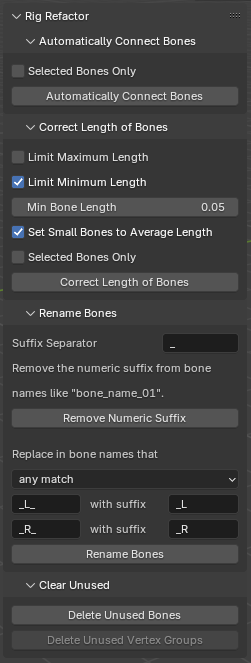
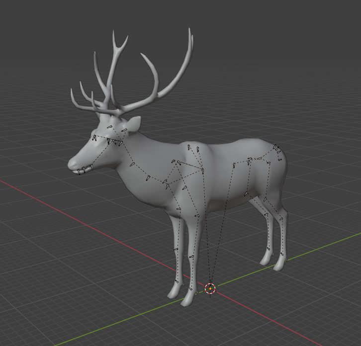
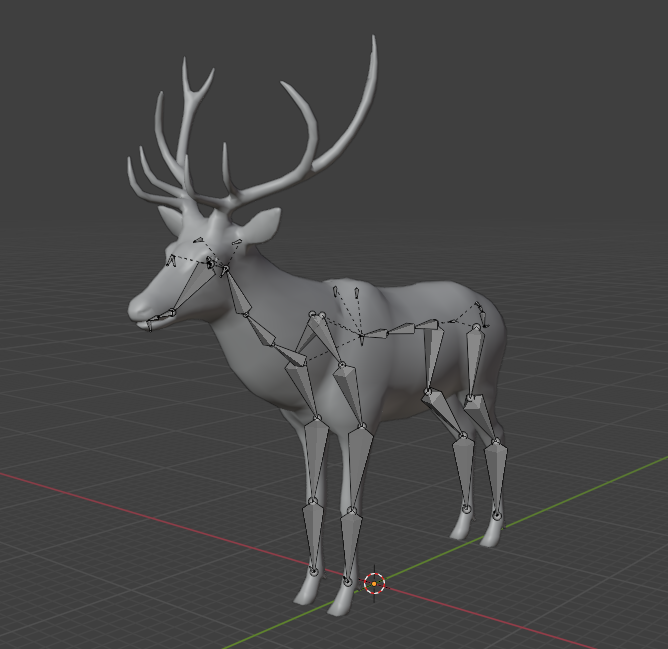

# Rig Refactor Blender Addon

Fix some common problems in imported rigged models.

## Download

[v1.0.0](https://github.com/x6ud/rig-refactor-blender-addon/releases/download/v1.0.0/rig_refactor.zip) (for Blender 4.3)

## Features

1. Automatically connect bones according to their parent-child relationship.

Example:

| Original                | Connected               |
|-------------------------|-------------------------|
|  |  |

2. Correcting bones that are too short or too long.

3. Remove the numeric suffix from bone names.

    Example:
    
    *Arm_L_042  ->  Arm_L*

4. Rename the paired bones to conform to Blender rules.

    Example:
    
    *Arm_L_1  ->  Arm_1_L*

    *Arm_R_1  ->  Arm_1_R*

5. Delete useless bones (those with no related vertex group or whose vertex group is empty).

6. Delete useless vertex groups (those whose related bones do not exist).
